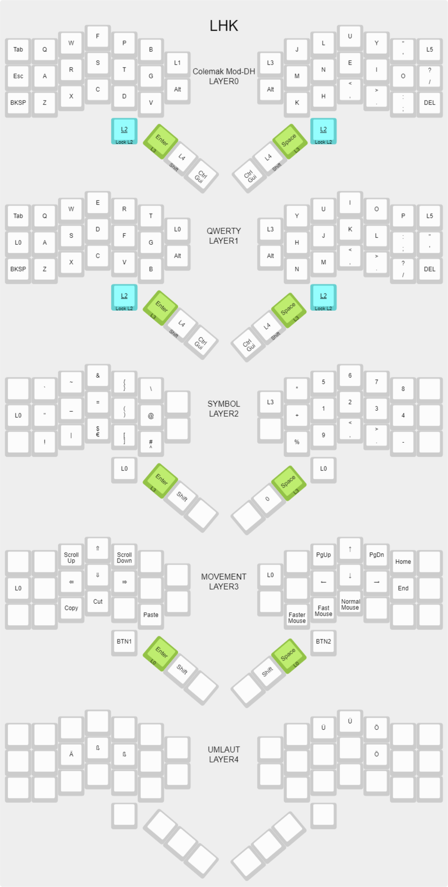

# LHK
The LHK is a 48 key keyboard using the [qmk firmware][1].

The [default layout][3] has 6 layers with the [Colemak Mod DH][2] layout as base, layer 0. By switching to layer 1, one can switch to a qwerty layout.

The core of this layout is in the second layer, called Symbol or ProgKeys. This layer contains all symbols and numbers. Closing brackets can be typed by double tapping the corresponding opening bracket twice. This layer can be enabled by holding the L2 key down. If both L2 keys are pressed simultaneously the layer is locked. Pressing g one L2 key unlocks it again.

Next is the Movement layer, layer 3, which can be enabled and disabled by pressing Space und Enter simultaneously. The Movement layer can be used to move the cursor or the mouse.

Finally, layer 4, the Umlaute layer. By quickly pressing and releasing Shift the Umlaute layer us activated for the next key press.

[1]: https://qmk.fm/
[2]: https://colemakmods.github.io/mod-dh/
[3]: http://www.keyboard-layout-editor.com/#/gists/b5255cedc98c3b00c219c887805e7e46
